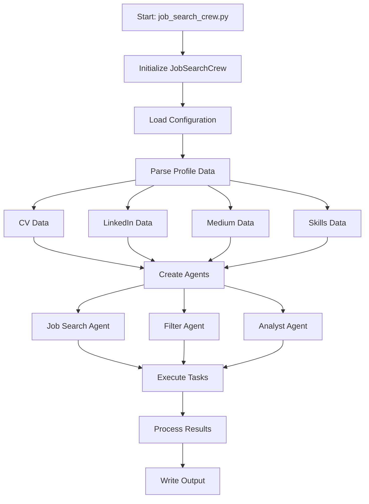

# Job Search Program Documentation

## 1. Entry Point and Program Flow

The program starts with `job_search_crew.py` as the main entry point. The following diagram illustrates the program flow:



The diagram above shows:
- Program initialization and configuration loading
- Parallel processing of different profile data sources
- Creation of three specialized agents
- Task execution flow
- Results processing and output generation

## 2. Core Components

### 2.1 JobSearchCrew (Main Orchestrator)
- **Location**: `job_search_crew.py`
- **Purpose**: Orchestrates the entire job search process
- **Key Functions**:
  - `__init__()`: Initializes configuration and profile data
  - `get_agents()`: Creates the three specialist agents
  - `create_tasks()`: Defines the workflow tasks
  - `run()`: Executes the job search process
  - `write_output()`: Formats and saves results

### 2.2 Job Filter Agent
- **Location**: `agents/job_filter_agent.py`
- **Purpose**: Filters and ranks job listings
- **Key Functions**:
  - `filter_jobs()`: Applies filtering criteria to job listings
  - `process_jobs()`: Calculates match scores and analyzes fit
  - `get_agent()`: Creates the specialist agent instance

### 2.3 Job Analyst Agent
- **Location**: `agents/job_analyst_agent.py`
- **Purpose**: Analyzes job market trends and provides insights
- **Key Functions**:
  - `analyze_jobs()`: Generates market insights from filtered jobs
  - `_generate_recommendations()`: Creates targeted recommendations

## 3. Required Program Inputs

### 3.1 Profile Data Files
The program expects the following profile data files in the configured paths:

1. **CV Data**
   - `cv_template.txt`: Current CV in text format
   - `cv_long.txt`: Detailed CV with full experience
   - `cv_more.txt`: Additional CV details (optional)

2. **LinkedIn Data**
   - `linkedin_profile.json`: Basic profile information
   - `linkedin_experience.json`: Work experience
   - `linkedin_posts.json`: Professional posts and articles
   - `linkedin_positions.json`: Past and current positions
   - `linkedin_certifications.json`: Professional certifications
   - `linkedin_education.json`: Educational background
   - `linkedin_endorsements.json`: Skill endorsements
   - `linkedin_articles.json`: Published articles

3. **Medium Data**
   - `medium_profile.json`: Medium blog posts and publications

4. **Skills Data**
   - `skills.json`: Structured skills inventory
     ```json
     {
       "technical": ["skill1", "skill2"],
       "soft": ["skill1", "skill2"],
       "tools": ["tool1", "tool2"]
     }
     ```

### 3.2 Configuration File
`search_config.yaml` must contain:

```yaml
profile_paths:
  cv_template: "path/to/cv_template.txt"
  cv_long: "path/to/cv_long.txt"
  cv_more: "path/to/cv_more.txt"
  skills: "path/to/skills.json"
  linkedin_profile: "path/to/linkedin_profile.json"
  # ... other LinkedIn paths
  medium_profile: "path/to/medium_profile.json"

search_criteria:
  positions:
    - "Software Engineer"
    - "Senior Developer"
  locations:
    - "London"
    - "Remote"
  salary:
    min: 50000
    max: 150000
    currency: "GBP"
  contract_types:
    - "permanent"
    - "contract"

filters:
  - name: "Senior Roles"
    min_salary: 80000
    contract_type: "permanent"
    keywords:
      - "senior"
      - "lead"
      - "architect"
```

### 3.3 Environment Variables
Required environment variables:
- `OPENAI_API_KEY`: OpenAI API key for LLM operations
- `ADZUNA_APP_ID`: Adzuna API application ID
- `ADZUNA_API_KEY`: Adzuna API key

## 4. Detailed Process Flow

1. **Initialization Phase**
   ```python
   # In job_search_crew.py
   crew = JobSearchCrew()
   ```
   - Loads configuration from `search_config.yaml`
   - Initializes profile parser and analyzer
   - Sets up job matcher and filters

2. **Profile Analysis Phase**
   - Parses multiple data sources:
     - CV data: Professional experience and skills
     - Skills data: Technical and soft skills inventory
     - LinkedIn data: Experience, posts, and professional network
     - Medium profile data: Technical writing and expertise areas

3. **Agent Creation Phase**
   - Creates three specialized agents:
     1. Job Search Agent: Finds relevant positions
     2. Filter Agent: Ranks and filters positions
     3. Analyst Agent: Provides market insights

4. **Task Execution Phase**
   ```python
   tasks = [search_task, filter_task, analysis_task]
   crew = Crew(agents=agents, tasks=tasks)
   result = crew.kickoff()
   ```
   - Search for jobs matching criteria
   - Filter and rank jobs based on profile match
   - Analyze results and generate recommendations

5. **Output Generation Phase**
   - Formats detailed job matches
   - Includes match analysis and recommendations
   - Writes results to output file

## 5. Configuration and Dependencies

### Required Files:
- `search_config.yaml`: Search criteria and filters
- `config_loader.py`: Configuration loading utilities
- Profile data files:
  - CV template
  - Skills inventory
  - LinkedIn data exports
  - Medium profile data

### Key Dependencies:
- CrewAI framework for agent orchestration
- OpenAI for analysis and matching
- Various utility modules for parsing and analysis

## 6. Output Format

The program generates a detailed output file containing:
- Job listings with match scores
- Technical and leadership fit analysis
- Key matching points and gaps
- Recommendations for profile improvements
- Salary and market trend analysis

## 7. Error Handling

The system includes comprehensive error handling for:
- Configuration loading issues
- Profile parsing failures
- API communication errors
- Results processing problems

## 8. LLM Integration and Matching Algorithms

### 8.1 LLM Usage Points

1. **Profile Analysis** (`ProfileAnalyzer` class)
   - **Input**: Combined profile data (CV, LinkedIn, Medium)
   - **LLM Task**: Analyze and extract key competencies, experience levels, and expertise areas
   - **Output**: Structured profile analysis with skills categorization and expertise levels

2. **Job Filtering** (`JobFilter` class)
   - **Input**: Job listing and profile analysis
   - **LLM Task**: Deep semantic matching between job requirements and candidate profile
   - **Output**: Match score and detailed reasoning for the match

3. **Market Analysis** (`JobAnalystAgent` class)
   - **Input**: Filtered job listings and market data
   - **LLM Task**: Generate insights about job market trends and career recommendations
   - **Output**: Market analysis report and personalized recommendations

### 8.2 Matching Algorithm Design

The system uses a hybrid approach combining traditional algorithmic matching and LLM-based semantic matching:

#### Traditional Matching Component
- **Location**: `utils/job_matcher.py`
- **Algorithm**:
  1. Keyword matching with skill requirements
  2. Experience year calculation and matching
  3. Location and salary range filtering
  4. Weighted scoring based on exact matches

#### LLM-Based Semantic Matching
- **Location**: `utils/job_filter.py`
- **Algorithm**:
  1. Context preparation: Combine job description and profile analysis
  2. Semantic analysis: Deep understanding of role requirements
  3. Competency mapping: Match candidate capabilities to job needs
  4. Reasoning generation: Explain why/how the candidate matches

#### Combined Scoring
The final match score is calculated as:
```python
final_score = (0.4 * traditional_score + 0.6 * llm_score) * 
              location_multiplier * 
              salary_range_multiplier
```

### 8.3 LLM Configuration

- **Model**: GPT-4
- **Temperature**: 0.7 for creative analysis, 0.2 for factual matching
- **Context Window**: 8k tokens for comprehensive analysis
- **Retry Logic**: Implemented for API failures with exponential backoff

---
Last Updated: 2025-01-15
